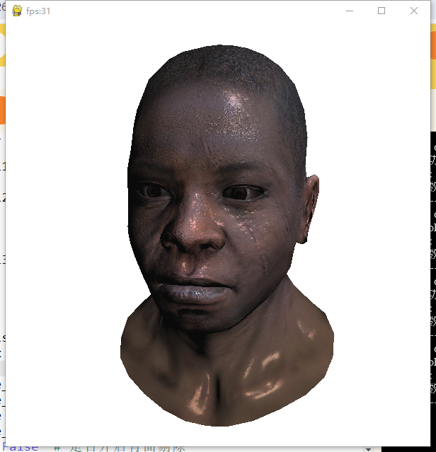

# tinyrenderer-pygame
使用pygame实现的tinyrenderer，需要pygame、numba、numpy和PIL。
左右键切换着色模式，O键开启正背面剔除

### Features:
- [x] z-buffer 渲染
- [x] 纹理贴图
- [x] 齐次空间裁剪
- [x] 窗口大小自由调整
- [x] Gouraud着色 和 Phong着色
- [x] Gouraud着色的多光源渲染
- [x] 带 .mtl 的 .obj 文件加载
- [x] 正背面剔除
